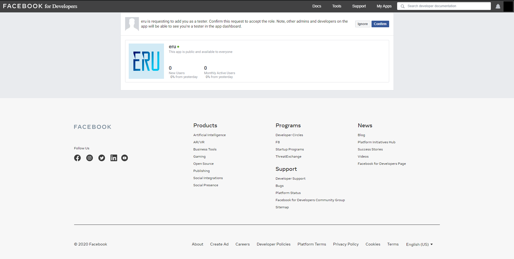

# Facebook Messenger Open Beta

## How to participate & prerequisites

### Our prerequisites 

We are open for everybody who: 
1. Attends XX LO (Gdansk, Poland)
2. Is willing to report every bug to the project maintainers

### Facebook prerequisites

To register as a developer on Facebook you have to 'verify' your account. Facebook consider account as verified when (1) it has a valid & confirmed phone number or (2) it has a verified credit card. You can check whether you have a verified phone number [here](https://www.facebook.com/settings?tab=mobile).

This is what you should see after visiting this link. 

### How to participate? 

Write to our maintainer and kindly ask for a tester invitation. Then, follow the instruction. We'll really appreciate everybody as a tester :)

## Create a Facebook Developer Account

Head to [Facebook for Developers](https://developers.facebook.com/) website and click Get Started.

Then, accept terms and conditions. 

You may be also asked for registration purpose (you can choose 'Other'). After this, you'll get the ability to join app as a tester :)

## Accept invitation to join testing team at eru

If you are a registered developer at Facebook and our maintainer invited you to join our team, you need to accept this invitation. Go straight to https://developers.facebook.com/requests/.

Accept the request by clicking accept. 

Voila! Now you can use the bot as a tester. 

## Create a subscription

To create a subscription, you need to write to our page called Eru. Grab a [direct link](https://m.me/105566531290178) and start now!

Here just click 'Message'.

Write 'hello' (or anything else) to start the conversation.

Select your preferred language. If you will make a mistake and will need to change your data - click 'Cancel' and start registration again. 

Select your grade (1st, 2nd or 3rd).

Select your section from the list. Remember that you can scroll the list using your fingers (swipe right or left to scroll).

Confirm subscription & you're free to go!

If you'll ever want to cancel the subscription (or registration), just click Cancel at any time.