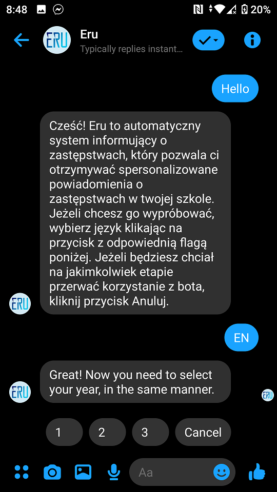

# [PL] Facebook Messenger Open Beta

## Jak dołączyć do bety

### Nasze wymagania

Jesteśmy otwarci dla każdego, kto: 

1. Uczęszcza do XX LO (Gdańsk, Polska)

2. Obiecuje zgłaszać ewentualne błędy do zespółu Eru :)

### Wymagania Facebooka

Aby zarejestrować się jako deweloper na Facebooku, twoje konto musi być 'zweryfikowane'. Facebook uznaje konto za zweryfikowane gdy (1) posiada ważny i potwierdzony numer telefonu lub (2) posiada zweryfikowaną kartę płatniczą. Możesz sprawdzić czy masz zweryfikowany numer telefonu [tutaj](https://www.facebook.com/settings?tab=mobile).

Tak powinna wyglądać ta strona, gdy masz zweryfikowany numer. 

### Jak zacząć? 

Napisz do kogoś z zespołu Eru i poproś o dodanie jako tester do aplikacji. Chętnie dodamy każdego :)

## Utwórz konto deweloperskie na Facebooku

Wejdź na stronę [Facebook for Developers](https://developers.facebook.com/) i kliknij 'Get Started'.

Zaakceptuj warunki użytkowania. 

Być może zostaniesz również zostać zapytany o cel rejestracji - możesz wtedy wybrać opcję 'Other'. Od tego momentu masz aktywne konto developerskie na Facebooku :)

## Zaakceptuj zaproszenie do aplikacji Eru

Jeżeli masz już konto deweloperskie i otrzymałeś zaproszenie do zostania testerem, wejdź na https://developers.facebook.com/requests/ w celu zaakceptowania go.

Zaakceptuj zaproszenie klikając 'Confirm'.

Voila! Od teraz możesz używać bota jako tester. 

## Zasubskrybuj powiadomienia o zastępstwach

Aby założyć subskrypcję, musisz napisać do strony Eru. [Link do Messengera](https://m.me/105566531290178)

Kliknij na przycisk by przejść do czatu. 

Napisz 'hello' (lub cokolwiek innego) by rozpocząć proces rejestracji. 

Wybierz język. Jeżeli pomylisz się na dowolnym etapie - kliknij 'Anuluj' i rozpocznij proces rejestracji ponownie. 

Wybierz klasę do której chodzisz (pierwsza, druga lub trzecia). 

Wybierz oddział do którego uczęszczasz. Pamiętaj, że lista jest przewijalna (po prostu przesuń palcem w lewo lub w prawo). 

Potwierdź subskrypcję i czekaj na powiadomienia ;)

Jeżeli będziesz chciał zrezygnować z subskrypcji (lub rejestracji) po prostu kliknij Anuluj na dowolnym etapie. 
